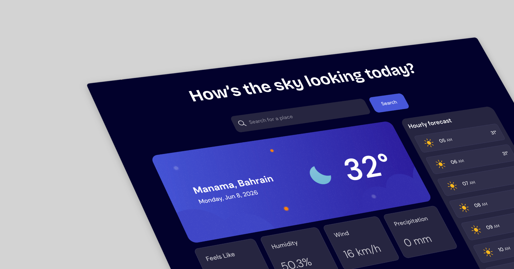

# Weather App Project

This is a solution to the [Weather App challenge](https://www.theodinproject.com/lessons/node-path-javascript-weather-app) from The Odin Project.

## Links

-   Solution on [GitHub](https://github.com/sydalwedaie/odin-project-weather-app)
-   Live preview on [Netlify](https://odin-weather-app-not4g.netlify.app/)

## Tools and Techniques Used

It's a vanillaJS project with two APIs. Visual Crossing's [Weather API](https://www.visualcrossing.com/weather-api/) to get the weather data, and [LocationIQ](https://locationiq.com/) to get city and country names. The script would first fetch the weather data (given a user's query for a place), and feed the coordinates from the response into the LocationIQ API to fetch the location's details.

Unlike the Todo app project, where I used classes exclusively, for this project, I opted for factory functions. Unlike a Todo app, where hundreds of Todos may benefit from the low memory footprint prototypes, this weather app basically had only 3 view functions that would render only once on initial load. I also wanted to alternate between classes and functions in my projects to get used to both approaches.

## What I learned

This project follows the Asynchronous JavaScript section of the Odin Project. Although the theory lessons did a good job of explaining the concepts, it was only during this project that I internalized them. The first gotcha was when I tried to render the DOM _after_ I called the fetch data from the weather API. I naively had a `render` function that would take the fetched weather data as its input. When I called the render function, I noticed there was a delay until anything showed up. Only then did I realize that the render function was being blocked by the fetch function, which used promises to get the weather data. So, I created a factory function that returned two functions: one `render` function to just render an empty skeleton, and a `load` function to _hydrate_ the DOM only when the data is received.

I made use of the browser's [Geolocation API](https://developer.mozilla.org/en-US/docs/Web/API/Geolocation_API/Using_the_Geolocation_API#examples) to fetch the weather data for the current location upon inital load. This is a native API which works asynchronously. I set up a `loadData` function and called it twice; once inside the geolocation function, and another as the click handler for the search button.

## Attribution

-   Design by [Frontend Mentor](https://odin-weather-app-not4g.netlify.app/)
-   Beautiful weather icons by [Meteocons](https://meteocons.com/)
-   Loading icons by [megacdn](https://magecdn.com/tools/svg-loaders)
